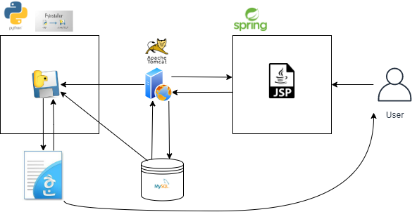
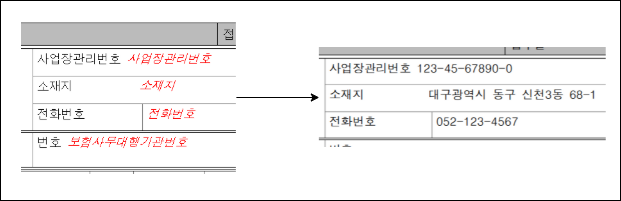

# # 2021 K-Digital Training HACKATHON 참가
- 해커톤 사이트: http://www.k-digitalhackathon.kr/
  
## # 개요

|팀명|너와 나의 연결고리|
|:---:|:---|
|주제|소상공인 4대 보험 민원 신고 자동 기입 플랫폼 서비스|
|소개|온라인 4대 보험 민원 신고 과정에서 복잡한 서류와 처리 방식을 간소화하는 서비스 플랫폼 구축|



## # 일정

* 6/14~6/25 해커톤 참가 신청
  - 아이디어 기획서를 작성 &#10140; 신청

* 6/30 1차 예선 합격
  - 총 34팀 합격

* 7/2 해커톤 OT&웨비나
  - 줌을 통해 온라인으로 진행

* ~7/14 2차 예선 제출
  - 아이디어 기획서와 발표자료 작성 &#10140; 신청


## # Python_hwp Repository
팀프로젝트 한글 문서 자동화
## # Python_hwp exe




## # 주요기능

* 한글 문서 작성
  - Olefile, win32com을 사용하여 hwp 파일을 제어했습니다.
  - 아래아 한글 라이브러리를 활용하였습니다.

  ``` 
  //근로자_자격취득신고서.py -> hwp 문서의 누름틀 작성
  //PutFieldText(누름틀 필드명, 데이터) 
  for target,data in zip(column_name,sql_result):

    if(data==None):
        hwp.PutFieldText(target, "")
        print(target, data)
    else:
        hwp.PutFieldText(target, data)
        print(target, data)
        
  ``` 
* DB에 값이 들어오면 문서작성
  - DB는 MySql을 사용하였습니다.
  - Python threading을 사용하여 DB table에 값이 들어오면 문서작성 기능이 동작하도록 하였습니다.

## # 선행 조건

* 한글 문서 전처리
  - 기록하고자 하는 문서를 누름틀 필드명으로 지정해야함 

* DB 테이블 컬럼명 통일
  -  컬럼명과 동일한 필드명에 값을 넣음


<details>
    <summary>진행 사항 기록</summary>

<!-- summary 아래 한칸 공백 두고 내용 삽입 -->
  - 알게된 사실
    - win32com때문에 윈도우 기반에서만 가능한것같음
    - 누름틀 기능으로 한글에서 위치를 지정할수있음
      - 사전 작업 필요
    - 입력이 안된 누름틀이 있을 경우 붉은색으로 표시
      - pdf로 변환시 누름틀이 안보임으로 해결
    - 한글2020이 아닐 경우 페이지가 달라지면 누름틀 정상적으로 동작하지 않는것으로 보임
  - 진행중
    - 멀티 쓰레드를 활용하여 DB에 입력값이 있을 경우 자동으로 문서 작성 기능 구현중
  - 완료
    - DB에 있는 테이블 컬럼명을 가져옴
    - hwp -> pdf로 변환
    - threading을 활용하여 DB에 값이 들어오는지 실시간 파악
</details>
